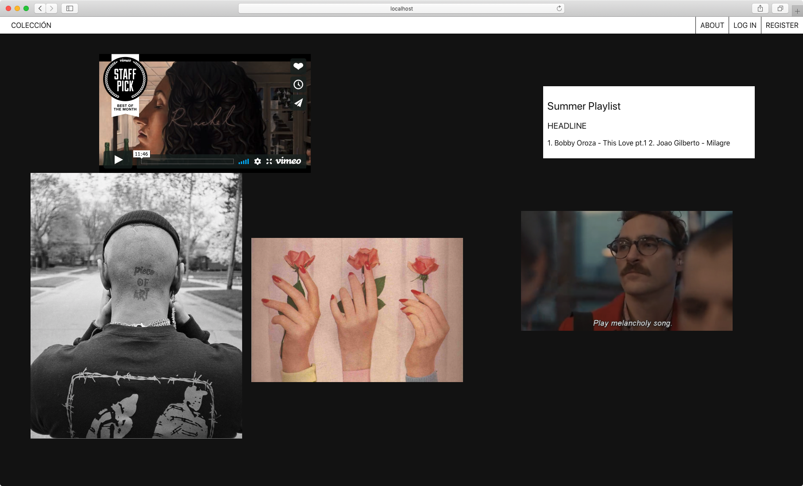
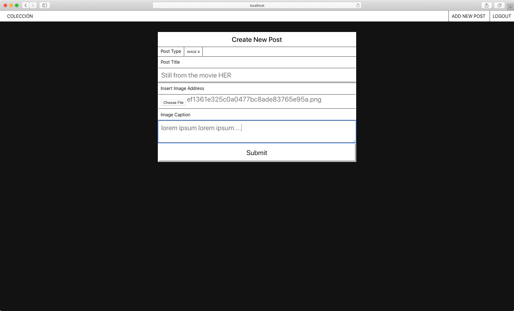
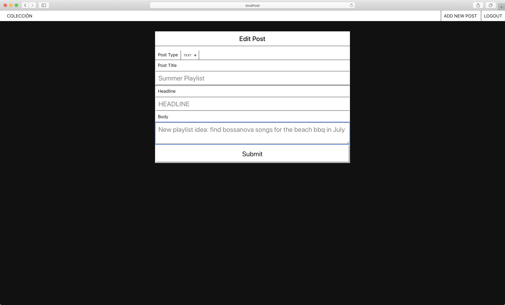
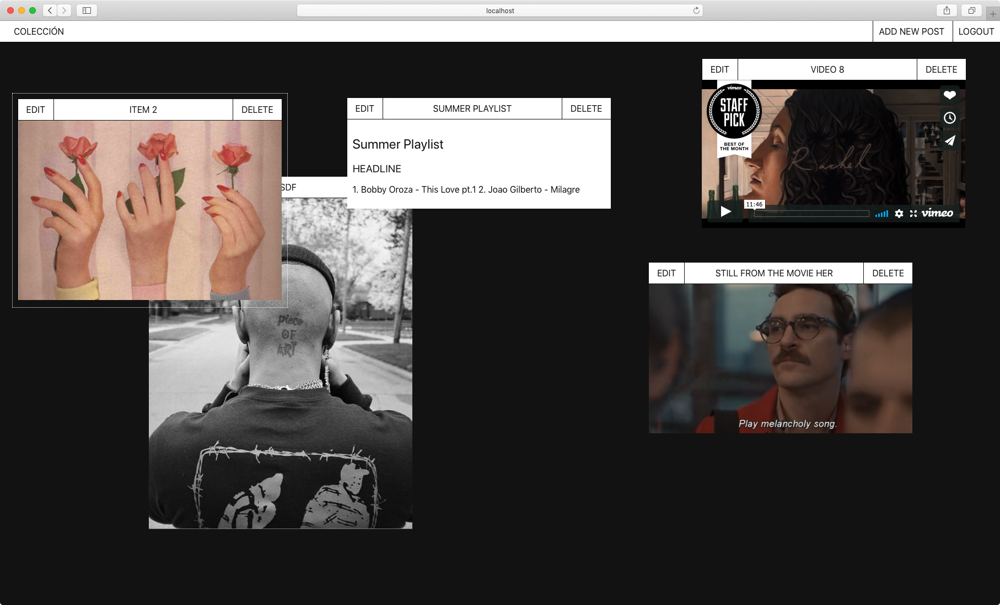

# Colección

Colección is an interactive, multimedia, collage-style blog leveraging React, Express, jQuery, Node, PostgreSQL, and SASS. Authors can create Image, Video, or Text post objects. These posts can be resized and rearranged as a collage. Visitors are able to interact with the positioning and sizing of the objects to their liking.


## Getting Started

These instructions will get you a copy of the project up and running on your local machine for development and testing purposes. See deployment for notes on how to deploy the project on a live system.

### Installing

1. `git clone` the project to your local directory
2. `rm -rf .git && git init` to create a new repository
3. `npm install` to install dependencies

### Set Up

1. Create new database titled `coleccion`
2. Create table for `users`
```
adfa
```
3. Set up UUID to generate unique ids in the `coleccion_posts` table
```
CREATE EXTENSION IF NOT EXISTS "uuid-ossp";
```
4. Create table for `coleccion_posts` including a `post_type` enum. This will ensure that posts are either `Image`, `Video`, or `Text`
```
CREATE TYPE post_type AS ENUM (
	'Text',
	'Video',
	'Image',
	'Audio');
CREATE TABLE coleccion_posts (
		id uuid NOT NULL DEFAULT UNIQUE uuid_generate_v4(),
		title text NOT NULL,
		caption text NULL,
		text_title text NULL,
		text_content text NULL,
		image text NULL,
		video text NULL,
		audio text NULL
	);
ALTER TABLE coleccion_posts
  ADD COLUMN
    type post_type UNIQUE NOT NULL;
```
5. The final table is `styles`. It references the Primary Key of `id` in the `coleccion_posts` table. The React front end will make a POST request and insert a new post object into the `coleccion_posts` table. The returned ID is subsequently sent to the `styles` table and inserted. This ensures that each 'post' entry has a corresponding styles entry. As the styles are updated in the front end, PATCH requests are sent to the `styles` table
```
CREATE TABLE public.styles (
	id INTEGER NOT NULL GENERATED BY DEFAULT AS IDENTITY,
	post uuid NOT NULL UNIQUE REFERENCES coleccion_posts(id),
	top_style text NULL,
	left_style text NULL,
	width_style text NULL,
	height_style text NULL,
	z_index INTEGER NULL
);
```

## Server Address

https:// blah blah

## React Front End

https://github.com/thinkful-ei-dragonfly/lucas-capstone-client

## Built With

1. [Express](https://expressjs.com/)
2. [Node](https://nodejs.org/en/)
3. [Bcrypt](https://www.npmjs.com/package/bcryptjs)
4. [JsonWebToken](https://github.com/auth0/node-jsonwebtoken)
5. [XSS](https://www.npmjs.com/package/xss)


## Screenshots

`GET /api/posts`
* Does not require authentication
* API returns all posts in the database



`POST /api/posts`
* Requires authentication using JsonWebTokens
* Authenticated POST requests insert a new 'post' object into the `coleccion_posts` table. The API responds with the newly created post object.




`POST /api/styles`
* The client makes a subsequent call to `POST /api/styles` passing in the newly created object's `id`.
* The API inserts a new object with the id passed in to the `post` column, which is a foreign key referencing the `coleccion_posts` table `id` column.
 * This ensures each post object has a corresponding database entry for custom css styles

`PATCH or DELETE /api/posts/:post_id`
* Requires authentication
* When users are logged in to the React front end, they are able to edit or delete posts.
* Editing posts will send a PATCH request with the updated fields and update the `coleccion_posts` database table
* Deleting posts will send a DELETE request and remove the id from both the `coleccion_posts` and `styles` tables



`PATCH /api/styles/:style_id`
* Requires authentication
* When users are logged in to the React front end, changes are detected after the user interacts with the post object. They can resize, rearrange, and change the `z-index` stacking of their posts.
* Event listeners wait for these changes to occur, and send values for `top`, `left`, `width`, `height`, and `z-index` style changes.




## Deploying

When your new project is ready for deployment, add a new Heroku application with `heroku create`. This will make a new git remote called "heroku" and you can then `npm run deploy` which will push to this remote's master branch.
